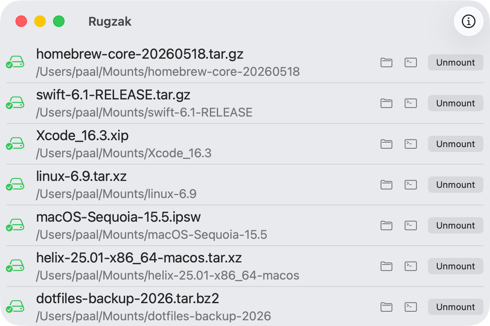

# :school_satchel: Rugzak

> A minimal macOS app that mounts archives as read-only virtual disks via
> [fuse-archive](https://github.com/google/fuse-archive) and [macFUSE](https://github.com/macfuse/macfuse).

Drop a zip, tar, or any supported archive onto the Dock icon or the window — **Rugzak** mounts it
instantly under `~/Mounts/<name>/` and keeps a live list of what is mounted and where.
Unmounting is one click away.

<div align="center">
  <picture>
    <source media="(prefers-color-scheme: dark)" srcset="docs/screenshots/screenshot_dark.png">
    <source media="(prefers-color-scheme: light)" srcset="docs/screenshots/screenshot_light.png">
    
  </picture>
</div>

---

## Requirements

| Dependency                           | Install                       | Notes            |
| ------------------------------------ | ----------------------------- | ---------------- |
| [macFUSE](https://osxfuse.github.io) | `brew install --cask macfuse` | Kernel extension |

`fuse-archive` is **bundled** inside the app — no separate install required.

> [!IMPORTANT]
> macFUSE requires a kernel extension. After installing, go to **System Settings → Privacy &
> Security** and allow the macFUSE system extension, then reboot.

---

## Getting started

```bash
# 1. Clone
git clone https://github.com/paaloeye/rugzak.git
cd rugzak

# 2. Check out vendored dependencies (fuse-archive, libb2, libarchive)
bash scripts/vendor_init.sh

# 3. Bootstrap build metadata — required once so Xcode can open the project
bash scripts/generate_build_info.sh

# 4. Open in Xcode and run, or build from the command line
bash scripts/build.sh
```

`vendor_init.sh` clones `fuse-archive`, `libb2`, and `libarchive` into `vendor/` at their pinned commits.
`generate_build_info.sh` writes `Config/GeneratedBuildInfo.xcconfig`, which Xcode needs before
the first build phase can run. Both scripts are idempotent; after the initial bootstrap all
build phases run automatically inside Xcode on every subsequent build.

---

## Usage

| Action                | How                                                                        |
| --------------------- | -------------------------------------------------------------------------- |
| Mount an archive      | Drop it onto the Dock icon or the app window                               |
| Browse contents       | Click **Open in Finder** next to the mount                                 |
| Open a terminal there | Click **Open in Terminal** (Ghostty preferred, falls back to Terminal.app) |
| Unmount               | Click **Unmount** and confirm                                              |

Mounts are placed under `~/Mounts/<archive-name>/`. If a name is already taken a numeric suffix is
appended (`project_1`, `project_2`, …).

Archives mounted outside of Rugzak (e.g. via the command line) are automatically reconciled into
the list on launch and whenever macOS reports a disk event.

---

## Supported formats

Rugzak passes the archive directly to the bundled `fuse-archive`.
The bundled build links macOS system libraries (zlib, bzip2, iconv) and the vendored libb2/BLAKE2
static library to keep the app self-contained. Formats requiring xz/lzma, zstd, or lz4 are not
available in the bundled build; install `fuse-archive` via Homebrew and Rugzak will use it
automatically as a fallback.

| Format group                                                              | Bundled | With Homebrew `fuse-archive` |
| ------------------------------------------------------------------------- | ------- | ---------------------------- |
| `zip`, `zipx`, `jar`, `war`, `apk`, `ipa`, `epub`, `cbz`, …               | ✅      | ✅                           |
| `tar`, `tar.gz`, `tar.bz2`, `cpio`, `ar`, `deb`, `rpm`                    | ✅      | ✅                           |
| `tar.xz`, `tar.lzma`, `xip`, `xar`                                        | 🔲      | ✅                           |
| `tar.zst`                                                                 | 🔲      | ✅                           |
| `tar.lz4`                                                                 | 🔲      | ✅                           |
| `7z`, `rar`, `cab`, `iso`, `lha`, `lzh`, `warc`, `mtree`                  | ✅      | ✅                           |
| `cbr`                                                                     | ✅      | ✅                           |
| RAR5 (blake2 checksums)                                                   | ✅      | ✅                           |
| Compression filters `gz`, `bz2`, `z`                                      | ✅      | ✅                           |
| Compression filters `xz`, `zst`, `lz4`, `lzma`, `lzo`, `br`, `lrz`, `grz` | 🔲      | ✅                           |
| ASCII / encryption filters `base64`, `b64`, `uu`, `gpg`, `pgp`, `asc`     | ✅      | ✅                           |

> [!NOTE]
> Encrypted archives (password-protected zip, gpg, …) are not supported in v0.1. Full UI for
> encrypted archives is planned for v0.2.

---

## Building a distributable DMG

```bash
bash scripts/create_dmg.sh
```

The script builds in Release configuration, creates a drag-to-install DMG with the app and an
Applications folder alias, and optionally code-signs and notarises if credentials are present.

---

## Project structure

```
Rugzak/
├── Models/
│   └── MountedArchive.swift     — value type for a single mounted archive
├── Services/
│   ├── ArchiveManager.swift     — observable owner of the mount list
│   ├── FuseProcess.swift        — fuse-archive process wrapper
│   ├── MountReconciler.swift    — reads kernel mount table on startup
│   └── UmountProcess.swift      — /sbin/umount wrapper
└── Views/
    ├── ContentView.swift         — main window
    ├── DropTargetView.swift      — drag-and-drop NSView bridge
    └── AboutView.swift           — version / build / commit panel
```

---

## Known limitations

- macFUSE mounts are **read-only**; you cannot write back into the archive.
- Encrypted archives are **not yet supported** (v0.2 planned).
- The bundled `fuse-archive` omits xz/lzma, zstd, and lz4. Install `fuse-archive` via Homebrew
  for full format coverage.

---

## Licence

MIT — see [LICENCE](./LICENCE).
